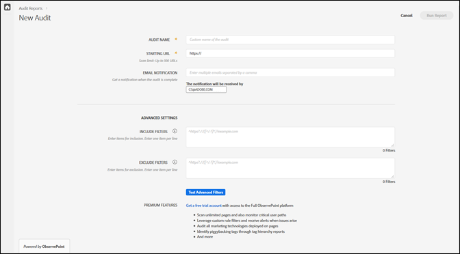

# Neue Prüfung erstellen {#create-a-new-audit}

>[!NOTE]
>
>Benutzer können jeweils nur eine Prüfung zur selben Zeit durchführen. Wenn Sie versuchen, eine Prüfung mit denselben Einstellungen wie die bereits ausgeführte zu starten, tritt ein Fehler auf. Sie können den Link in der Fehlermeldung verwenden, wenn Sie die derzeit ausgeführte Prüfung abbrechen möchten, damit Sie eine neue Prüfung erstellen können.

Verwenden Sie den Link unten auf der Seite, wenn Sie möchten, um auf ein kostenloses Testkonto von ObservePoint mit allen Funktionen zuzugreifen.

1. Klicken Sie in der Auditor-Liste auf **[!UICONTROL New Audit]**.

   Der [!DNL New Audit]-Bildschirm wird geöffnet.

   

1. (Erforderlich) Benennen Sie die Prüfung.

   Der Name kann aus bis zu 250 Zeichen bestehen.
1. (Erforderlich) Geben Sie die Start-URL an.

   Das Protokoll ist beim Festlegen der Start-URL erforderlich. Die Start-URL ist die Seite, auf der die Prüfung mit der Durchsuchung beginnt. Nach dem Start durchsucht Auditor bis zu 500 Seiten und folgt dabei Links, die an der Start-URL beginnen. Weitere Informationen finden Sie unter [Ein- und Ausschlussfilter](../create-audit/filters.md). Die Start-URL kann aus bis zu 250 Zeichen bestehen.

   >[!NOTE]
   >
   >In einigen Fällen kann es bis zu 48 Stunden dauern, um eine Prüfung für 500 Seiten durchzuführen.

1. Geben Sie mindestens eine E-Mail-Adresse für Benachrichtigungen zu dieser Prüfung an.

   Sie können mehrere E-Mail-Adressen angeben, indem Sie diese durch Kommata trennen. Der Anfragende wird standardmäßig benachrichtigt. E-Mail-Adressen werden in Echtzeit validiert. Wenn Sie eine ungültige Adresse eingeben, werden Sie auf dem Bildschirm darüber benachrichtigt.

   Jede E-Mail ist auf maximal 250 Zeichen beschränkt, einschließlich des Domänenendpunkts (z. B. „.com“).
1. Geben Sie Einschlussfilter an.

   Dieses Feld kann exakte URLs, Teil-URLs oder reguläre Ausdrücke enthalten. Verwenden Sie dieses Feld für Kriterien, denen jede URL entsprechen soll. Durchsuchte URLs, die nicht mit den Kriterien „Einschlussfilter“ übereinstimmen, werden nicht in die Prüfergebnisse aufgenommen.

   Sie können Ordner eingeben, für die die Prüfung durchgeführt werden soll. Alternativ können Sie eine domänenübergreifende bzw. selbstverweisende Prüfung durchführen, bei denen die Prüfung in einer Domäne starten und in einer anderen enden soll. Geben Sie dazu die Domänen ein, die Sie durchlaufen möchten. Für komplexe URL-Muster verwenden Sie einen regulären Ausdruck.

   >[!NOTE]
   >
   >Wenn Sie eine Seite in Ihren Filtern einschließen, sie jedoch nicht mit Ihrer Start-URL verbunden ist oder Auditor 500 Seiten geprüft hat, bevor die Seite erreicht wird, wird die Seite nicht geprüft und nicht in die Testergebnisse aufgenommen.

   Die Einschlussfilter sind auf 1.000 Zeichen pro Zeile beschränkt.

   Weitere Informationen finden Sie unter [Einschlussliste](../create-audit/filters.md).
1. Geben Sie Ausschlussfilter an.

   Die Ausschlussliste verhindert, dass URLs geprüft werden. Verwenden Sie exakte URLs, Teil-URLs oder reguläre Ausdrücke, genau wie in der Einschlussliste.

   Eine gängige Praxis besteht darin, einen Link zum Abmelden auszuschließen, wenn die Prüfung eine Benutzersitzung einschließt (z. B. `/logout`, d. h. jede URL, die die Zeichenfolge `/logout` enthält).

   Die Ausschlussfilter sind auf 1.000 Zeichen pro Zeile beschränkt.

   Weitere Informationen finden Sie unter [Ausschlussliste](../create-audit/filters.md).
1. (Optional) Bei Bedarf können Sie die Ein- und Ausschlussfilter sowie Ihre URLs testen.

   Geben Sie die Filter sowie URLs ein und klicken Sie dann auf **[!UICONTROL Apply]**, um den Test auszuführen.

   

1. Klicken Sie auf **[!UICONTROL Bericht ausführen]**.
