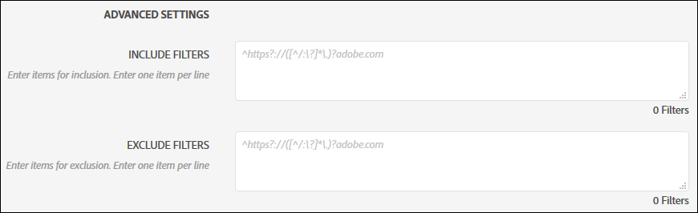
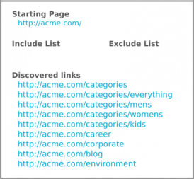
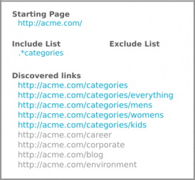
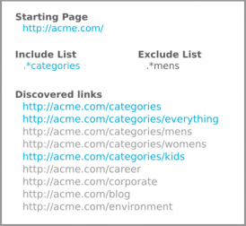
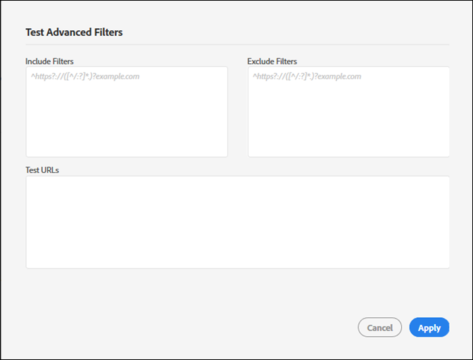

# Ein- und Ausschlussfilter {#include-and-exclude-filters}

Einschlussfilter beschränken, welche Links eine Prüfung von der Start-URL durchsuchen kann. Ausschlussfilter verhindern, dass eine Prüfung bestimmte Links durchsuchen kann.

<!--
Content from ObservePoint (https://help.observepoint.com/articles/2872121-include-and-exclude-filters) with their permission. Modified slightly for style and Auditor emphasis.
-->

Ein- und Ausschlussfilter enthalten Richtlinien für Prüfungen. Wenn Sie die Felder für Ein- und Ausschlussfilter leer lassen, kann eine Prüfung alle angetroffenen Links durchsuchen, beginnend mit Links in der Start-URL.



Indem Sie Ein- oder Ausschlussfilter bzw. eine Kombination aus beiden anwenden, können Anweisungen gegeben werden, welche Links bei einer Prüfung durchsucht werden können.

Jedes Element im Feld für Einschlussfilter beschränkt die Prüfung auf die Seiten, die mit diesem Element übereinstimmen. Jedes Element im Feld für Ausschlussfilter verhindert, dass Seiten, die diesem Element entsprechen, geprüft werden.

Ein- und Ausschlussfilter können vollständige URLs, Teil-URLs oder reguläre Ausdrücke sein, die einer gültigen Seite entsprechen.

## Rangfolge {#section-e9d42419dd3f459bb20e7a33c6104f12}

1. Die **Start-URL** hat Vorrang vor allem anderen und wird während einer Prüfung immer besucht, auch wenn eine URL mit einem Element in den Ausschlussfiltern übereinstimmt. Die Start-URL wird immer vor anderen URLs aufgerufen.

   

   Auf dem Bild oben werden bei einer Prüfung Links aus der `document.links`-Eigenschaft der Startseite erkannt. Diese Links können bei der Prüfung eingesehen werden.

1. **Einschluss-URLs** müssen von einer Startseite aus verknüpft werden, da sie andernfalls nicht erkannt und damit nicht besucht werden können.

   

   Auf dem Bild oben werden die zulässigen URLs durch Hinzufügen eines Einschlussfilters auf die URLs beschränkt, die mit dem Filter übereinstimmen. Jetzt können nur noch fünf Links bei der Prüfung eingesehen werden.

1. Durch **Ausschluss-URLs** werden Links von der Berechtigung ausgeschlossen.

   

   Auf dem Bild oben wird durch Hinzufügen eines Ausschlussfilters verhindert, dass auf URLs der entsprechenden Links zugegriffen werden kann. Jetzt können nur noch drei Links bei der Prüfung eingesehen werden.

## Start-URL {#section-ccb46abcd96f4a8ab171245015d2b724}

Auditor benötigt eine einzelne Seite für die Start-URL. Die Start-URL wird immer vor anderen URLs aufgerufen. Alle auf der Startseite gefundenen Links können besucht werden. Dies unterliegt allerdings den Ein- und Ausschlussfiltern. Wenn ein Ausschlusselement mit einer Start-URL übereinstimmt, wird es ignoriert.

## Einschlussfilter {#section-7626060a56a24b658f8c05f031ac3f5f}

Einschlussfilter beschränken, welche Links während einer Prüfung eingesehen werden können. Einschlussfilter können Folgendes umfassen:

* Vollständig qualifizierte URLs
* Teil-URL
* Reguläre Ausdrücke, die mit vollständigen oder Teil-URLs übereinstimmen
* Jede Kombination der oben genannten Optionen

Das Hinzufügen von URLs oder regulären Ausdrücken zum Einschlussfilter gewährleistet nicht, dass diese spezifischen URLs bei der Prüfung eingesehen werden. Bei der Prüfung werden die Links der Start-URL eingesehen und es folgt eine Navigation durch die entsprechenden Links. Bei der Prüfung wird dieser Prozess der Überprüfung und Navigation fortgeführt, bis die Grenze von 500 geprüften URLs erreicht ist oder keine weiteren zulässigen Links gefunden werden.

>[!NOTE]
>
>In einigen Fällen kann es bis zu 48 Stunden dauern, um eine Prüfung für 500 Seiten durchzuführen.

Standardmäßig werden bei einer Prüfung alle Subdomänen der Start-URL geprüft. Sofern nicht explizit durch Angabe eines Einschlussfilters überschrieben, verwendet die Prüfung den folgenden Regex-Einschlussfilter:

`^https?://([^/:\?]*\.)?mysite.com`

Dadurch kann jeder Link, der auf der Startseite der URL vorhanden ist, besucht werden. Dies entspricht jeder Seite aller Subdomänen der Start-URL.

Durch die Verwendung des standardmäßigen Einschlussfilters entsteht ein breiter Bereich, der bei einer Prüfung durchsucht werden kann. Wenn Sie sich bestimmten Abschnitten oder Seiten widmen möchten, geben Sie bestimmte Richtungen für Ihre Prüfung an, indem Sie in diesem Feld Filter hinzufügen. Ersetzen Sie in diesem Fall den Standardwert durch die Ordner, die geprüft werden sollen. Sie können Einschlussfilter auch verwenden, um domänenübergreifende Prüfungen durchzuführen, bei denen die Prüfung in einer Domäne starten und in einer anderen enden soll. Geben Sie dazu die Domänen ein, die Sie durchlaufen möchten. In jedem Fall müssen Einschlussfilter-URLs auf einer geprüften Seite angezeigt werden, damit sie gefunden werden können.

Einschlussfilter können exakte URLs, Teil-URLs oder reguläre Ausdrücke enthalten. Wenn die Start-URL beispielsweise [!DNL http://mysite.com] lautet, können folgende Seiten standardmäßig geprüft werden (beachten Sie die fett gedruckten Zeichen):

```
http://mysite.com
http
<b>s</b>://mysite.com
http://
<b>www</b>.mysite.com/home
http://
<b>dev</b>.mysite.com/home
http://
<b>my</b>.mysite.com/products/products_and_services.html
```

Für komplexe URL-Muster verwenden Sie den [ObservePoint-Test für reguläre Ausdrücke](http://regex.observepoint.com/).

Weitere Informationen zu häufigen Anwendungsfällen für die Musterzuordnung finden Sie im Dokument [Häufig verwendete reguläre Ausdrücke für ObservePoint](https://help.observepoint.com/articles/2872116-common-regular-expressions-for-observepoint).

## Ausschlussfilter {#section-00aa5e10c878473b91ba0844bebe7ca9}

Ausschlussfilter verhindern, dass URLs geprüft werden. Sie können exakte URLs, Teil-URLs oder reguläre Ausdrücke verwenden. Jede URL, die mit einem Element in den Ausschlussfiltern übereinstimmt, wird nicht besucht. Wenn Ihre Start-URL in den Ausschlussfiltern enthalten ist, wird sie nicht ausgeschlossen. Die Start-URL wird bei Prüfungen immer eingesehen.

## Testen von Filtern und URLs {#section-3cfa125b1756411395a64701e128efa0}

Sie können Ihre Filter und URLs in Auditor testen.

Klicken Sie beim Erstellen der Prüfung auf **[!UICONTROL Test Advanced Filters]**. Geben Sie Ihre Filter sowie URLs ein und klicken Sie dann auf **[!UICONTROL Apply]**.



## ObservePoint-Dokumentation {#section-79cdc8e850d047969b6d2badf6bbd6f9}

Dieser Artikel wurde in Zusammenarbeit mit ObservePoint entwickelt. Aktuelle Informationen finden Sie in der [ObservePoint-Dokumentation](https://help.observepoint.com/articles/2872121-include-and-exclude-filters).
