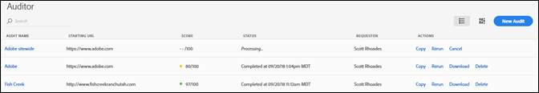
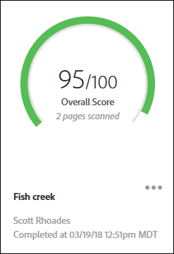
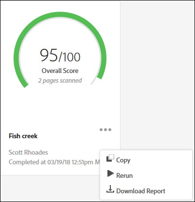

# Seite „Audit List“{#audit-list-page}

Auf der Seite „Audit List“ werden Informationen zu all Ihren Prüfungen angezeigt.

Wenn Sie Adobe Experience Platform Auditor starten, wird die Seite „Audit List“ angezeigt. Sie können die Seite „Audit List“ entweder als Listen- oder Kartenansicht anzeigen.

## Listenansicht {#section-a428749d2ab94a08bf460e6a486b844a}

In der Listenansicht werden folgende Informationen zu den einzelnen Prüfungen angezeigt.

| Element | Beschreibung |
|---|---|
| Prüfname | Der Name der Prüfung |
| Start-URL | Die URL, an der die Prüfung beginnt, Seiten zu durchsuchen |
| Ergebnis | Prüfungen werden von 1 bis 100 bewertet, wobei 100 bedeutet, dass es keine Probleme auf den geprüften Seiten gibt |
| Status | Zeigt an, wann die Prüfung abgeschlossen ist oder ob sie noch verarbeitet wird |
| Anfragenden | Zeigt den Namen des Benutzers an, der die Prüfung erstellt hat |
| Aktionen | Enthält Links zum Kopieren oder erneuten Ausführen der Prüfung, zum Abbrechen einer derzeit ausgeführten Prüfung, zum Herunterladen eines Berichts als [!DNL Excel]-Tabelle und zum Löschen der Prüfung |

Klicken Sie auf den Namen der Prüfung, um die Prüfergebnisse anzuzeigen.

## Kartenansicht {#section-6826b585e53a46daa722b9bd3eda926e}

Die Kartenansicht zeigt jede Prüfung im grafischen Format an.

Klicken Sie auf den Namen der Prüfung, um die Prüfergebnisse anzuzeigen. Klicken Sie auf das Menü neben dem Namen, um Links zum Kopieren, erneuten Ausführen oder Abbrechen der Prüfung anzuzeigen oder einen fertigen Bericht als [!DNL Excel]-Tabelle oder PDF herunterzuladen:

