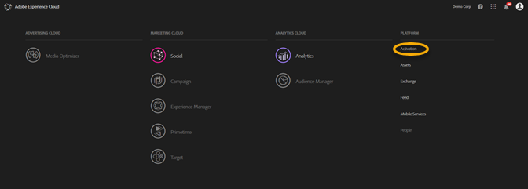
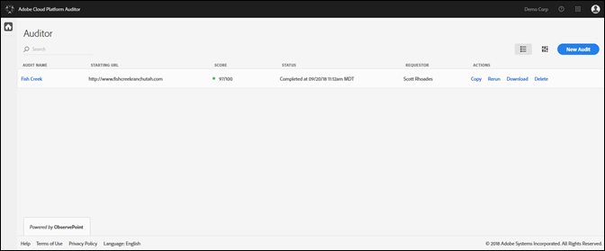
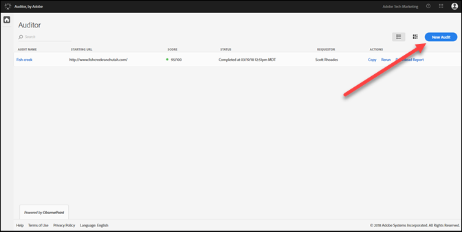
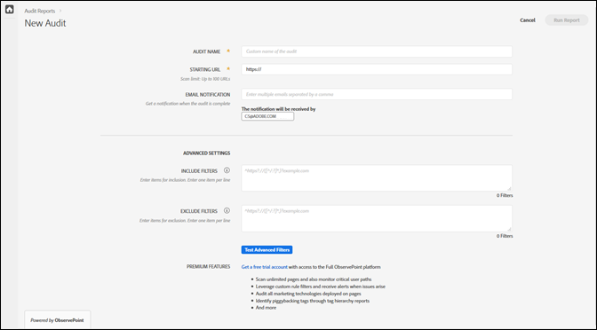
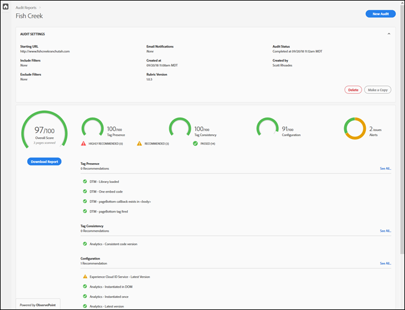

# Erste Schritte {#getting-started}

## Erste Schritte {#task-1024e94b5948413295c9698e62165a04}

<!--
This page is a placeholder for now, we need things like prerequisites, any planning that should be done before using Auditor, initial setup info--that kind of thing.
-->

The first time you use [!DNL Adobe Experience Platform Auditor], you must complete and accept the [!DNL Platform Auditor] agreement. [!DNL Platform Auditor] wurde als Zusammenarbeit zwischen [!DNL Adobe] und [!DNL ObservePoint]entwickelt. Plattformprüfer können die eingeschränkte ObservePoint-Funktionalität ohne zusätzliche Kosten verwenden. Zur Verwendung von Platform Auditor müssen Sie sich für die Kommunikation von ObservePoint entscheiden.

## Ausführen der ersten Prüfung {#task-b211597afed343cfa238443fcf7c6041}

1. Klicken Sie auf die Menüschaltfläche in der oberen rechten Ecke der Navigationsleiste von Adobe Experience Cloud und dann auf **[!UICONTROL Activation]**.

   

1. Select **[!UICONTROL Auditor]** and accept the Terms of Use.

   Auf der Seite &quot;Plattformprüfer&quot;finden Sie ein Dashboard der vorherigen Prüfungen sowie die Option, eine neue Prüfung auszuführen.

   

1. Klicken Sie auf **[!UICONTROL New Audit]**.

   Um eine neue Prüfung auszuführen, klicken Sie oben rechts im Bildschirm auf **[!UICONTROL New Audit]**.

   

1. Konfigurieren Sie die Prüfung.

   Benennen Sie die Prüfung, geben Sie eine Start-URL ein und klicken Sie auf **[!UICONTROL Run Report]**. Nach Abschluss der Prüfung erhalten Sie eine E-Mail-Benachrichtigung.

   

   Eine Beschreibung aller Konfigurationsoptionen finden Sie unter [Create a New Audit](../create-audit/create-new-audit.md).
1. Zeigen Sie Ihren Bericht an.

   Wenn Sie die E-Mail mit der Mitteilung erhalten, dass die Prüfung abgeschlossen ist, klicken Sie auf den Link, um [Ihren Bericht anzuzeigen](../reports/scorecard.md) und zu erkunden, welche Möglichkeiten zur Verbesserung Ihrer Implementierung bestehen und wie Sie mit Ihren Adobe-Lösungen einen Mehrwert erzielen.

   Sie können auch auf den Namen der Prüfung auf der [Auditor-Seite](../get-started/audit-list.md) klicken, um den Status der Prüfung anzuzeigen und den Bericht nach Abschluss der Prüfung anzuzeigen.

   
