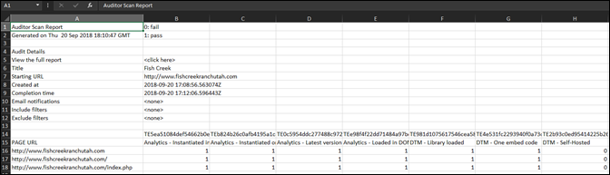

# Bericht herunterladen {#download-report}

Der Bericht zeigt an, ob die einzelnen URLs bestanden haben oder nicht.

Der Bericht kann auf der Scorecard-Seite der Benutzeroberfläche angezeigt werden. Sie können den Bericht auch herunterladen:

1. Klicken Sie in der Liste „Auditor“ oder in einer Scorecard auf **[!UICONTROL Bericht herunterladen]**.

   Sie können den Bericht als Tabelle oder PDF-Datei herunterladen.
1. Geben Sie an, ob die Datei geöffnet oder gespeichert werden soll.

1. Klicken Sie auf **[!UICONTROL OK]**.

   Die Tabelle zeigt an, ob die einzelnen Tests auf jeder Ihrer Seiten bestanden wurden oder nicht.

   

Die PDF-Datei enthält folgende Informationen:

* Prüfeinstellungen
* Abschlusszeitstempel
* Gesamtbewertung
* Ergebnis pro Kategorie
* Einheitentests, die für URLs angewendet wurden, die nicht bestanden haben
* Link der jeweiligen Empfehlungs- und Hilfedokumenten der Tests
