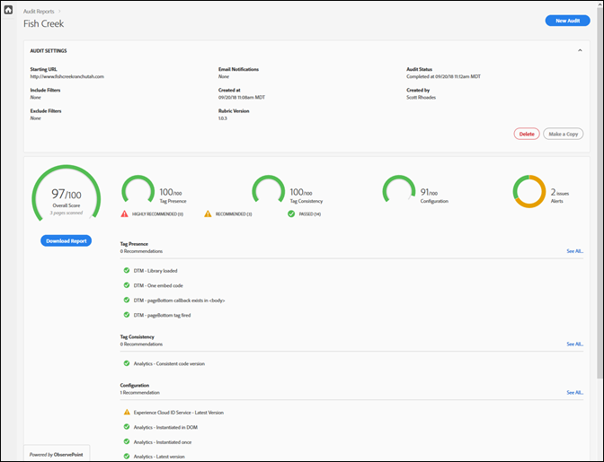
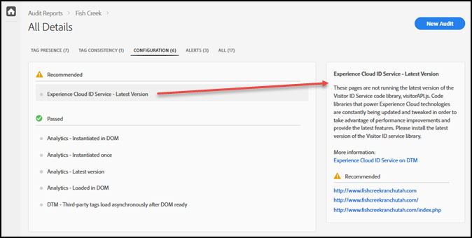

# Scorecard{#scorecard}

Nachdem Sie einen Test durchgeführt haben, zeigt die Scorecard Informationen zu einer Prüfung an.

Klicken Sie auf der Adobe Experience Platform Auditor-Seite auf den Namen Ihrer Prüfung, um die Ergebnisse Ihres Tests anzuzeigen.

Verwenden Sie die Scorecard, um zu sehen, wie die Prüfung in den folgenden Kategorien bewertet wurde:

* Gesamtbewertung
* Tag-Präsenz

   Wertet aus, ob das Tag vorhanden ist und es sich an der richtigen Stelle im Seitencode befindet.
* Tag-Konsistenz

   Wertet aus, ob die Tags über URLs hinweg konsistent sind.
* Konfiguration

   Wertet die Tags mit anderen Regeln und empfohlenen Best Practices aus.
* Warnhinweis

   Warnhinweise zeigen Probleme an, die Sie kennen sollten, aber sich nicht auf Ihr Ergebnis auswirken.

Ihr Ergebnis hängt von der Gewichtung jedes Tests ab und davon, ob der Test bestanden wurde oder nicht. Bei Bestehen eines Tests erhöht sich Ihr Ergebnis um die Anzahl der Punkte, die der Testgewichtung entsprechen.

* 0: Zeigt Probleme auf, die Sie kennen sollten, aber sich nicht auf Ihr Ergebnis auswirken.
* 1: Empfiehlt eine Optimierung. Keine Auswirkung auf die Datengenauigkeit.
* 2: Bei Nichtbestehen dieses Tests haben Sie keinen Zugriff auf die neuesten Funktionen und Fehlerbehebungen in der Adobe Experience Cloud.
* 3: Tests zur Effizienz und zur Einhaltung der dringend empfohlenen Best Practices bei der Implementierung.
* 4: Nichtbestehen bedeutet, dass Sie möglicherweise unzuverlässige Daten erfassen.
* 5: Nichtbestehen bedeutet, dass möglicherweise Datenverlust auftritt.

Die Scorecard listet die Behandlung aller Probleme der Stufe 4 oder 5 als **dringend empfohlen** auf.

Die Scorecard listet die Behandlung aller Probleme der Stufe 1 bis 3 als **empfohlen** auf.

Klicken Sie auf **[!UICONTROL Bericht herunterladen]**, um eine [!DNL Excel]- oder PDF-Datei herunterzuladen, die die Informationen der Prüfung enthält.

Neben dem Ergebnis für jede Kategorie werden in der Scorecard alle empfohlenen oder dringend empfohlenen Korrekturen sowie die Elemente aufgelistet, die den Test bestanden haben. Klicken Sie auf die einzelnen Probleme, um weitere Details im Feld auf der rechten Seite anzuzeigen. Klicken Sie erneut, um einen Drilldown durchzuführen und Empfehlungen zur Behebung des Problems anzuzeigen. Folgende Tabelle zeigt die Details zu einem Problem mit empfohlener Behebung in der oben gezeigten Scorecard:

Klicken Sie oben im Bildschirm auf die Kategorien, um die in den einzelnen Kategorien gefundenen Probleme anzuzeigen.

## Welche Seiten waren Teil des Tests? {#section-fd38ffeb868648e89c34c5772fa65f46}

Sie können Listen der URLs anzeigen, die Ihren Test bestanden bzw. nicht bestanden haben.

Klicken Sie in der Scorecard auf einen Testnamen oder auf den Link **[!UICONTROL See All]** unter jeder Kategorieüberschrift. Damit gelangen Sie zu den Details der Tests. Für jeden Test können Sie die Testbeschreibung und eine Liste aller URLs anzeigen, die nicht bestanden bzw. bestanden haben. Diese Informationen sind auch in heruntergeladenen Berichten enthalten.
